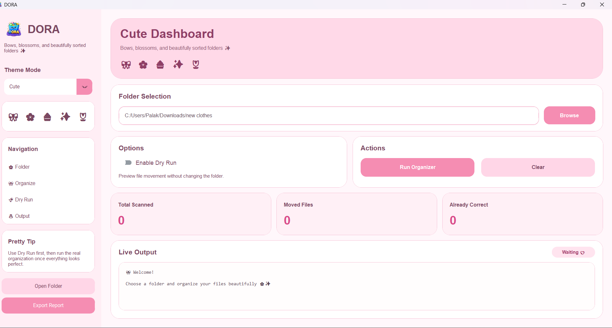

# 🚀 DORA — Desktop File Organizer

DORA (Digital Organizer & Routing Assistant) is a desktop file organization tool built using Python and CustomTkinter. It helps automate file sorting, correct misplaced files, and keep folders clean through a modern and intuitive GUI.

---

## 📂 Project Structure

```text
DORA/
│── gui.py
│── main.py
│── logo.png
│── logo.ico
│── README.md
│── .gitignore

## 📸 Screenshots

